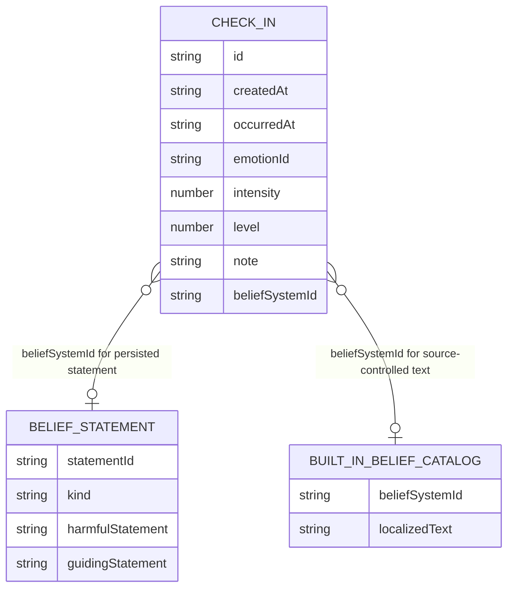

# Database

This document is the source of truth for Youmotion's current database setup, persisted check-in and belief-statement schemas, migration behavior, native packaging, and database-related development workflow.

## Overview

Youmotion is local-first. Check-ins, custom Leidsätze, and positive Leitsätze are stored in an embedded SurrealDB database backed by SurrealKV inside the app's document directory. The app does not currently connect to a remote database, upload these records, or configure database credentials.

The persistence path is:

```text
UI event
  -> root XState navigation machine
  -> Effect repository operation
  -> Effect Schema encode/decode boundary
  -> react-native-surrealdb
  -> embedded SurrealKV files in the app document directory
```

The relevant ownership boundaries are:

- `src/features/check-in/domain/check-in.ts`: canonical persisted check-in schema and types.
- `src/features/check-in/domain/belief-statement.ts`: built-in and custom belief IDs plus persisted Leidsatz/Leitsatz schemas.
- `src/features/check-in/domain/belief-system.ts`: stable belief-system IDs, emotion mappings, and history-based recommendation ranking.
- `src/features/check-in/infrastructure/check-in.repository.ts`: strict current-schema queries, persistence, and typed errors.
- `src/features/check-in/infrastructure/migrations/database-migration.runner.ts`: ordered startup migration execution and ledger validation.
- `src/features/check-in/infrastructure/migrations/database-migrations.ts`: append-only migration registry.
- `src/features/check-in/infrastructure/migrations/*.database-migration.ts`: individual idempotent migration definitions.
- `src/features/check-in/infrastructure/belief-statement.repository.ts`: custom Leidsatz and Leitsatz queries, persistence, and typed errors.
- `src/features/check-in/infrastructure/surrealdb.database.ts`: filesystem location and shared native connection.
- `src/features/check-in/application/check-in-history.store.ts`: validated in-memory history projection.
- `src/navigation/app-navigation.machine.ts`: hydration, save, retry, and edit workflows.
- `src/constants.ts`: database, table, retention, and legacy-storage constants.

UI code must not import the infrastructure layer directly. Database work is initiated by the root actor and reported back through schema-typed machine events.

## Runtime configuration

The database configuration is defined in `src/constants.ts`:

| Setting | Current value | Meaning |
| --- | --- | --- |
| Directory | `youmotion-surrealdb` | Child of Expo's platform-specific app document directory |
| Endpoint prefix | `surrealkv://` | Selects the embedded SurrealKV engine |
| Namespace | `youmotion` | SurrealDB namespace |
| Database | `local` | SurrealDB database within the namespace |
| Check-in table | `check_in` | Table containing captured moments |
| Belief-statement table | `belief_statement` | Table containing custom Leidsätze and attached Leitsätze |
| Migration ledger table | `database_migration` | Records durable database migrations already applied to this installation |
| History read limit | `30` | Maximum records loaded into the current app history |
| Note limit | `240` | Maximum persisted note length |
| Belief-statement limit | `240` | Maximum length of each Leidsatz or Leitsatz |
| Custom ID prefix | `custom-` | Distinguishes user-created Leidsätze from built-in IDs |
| Legacy key | `youmotion.check-ins.v1` | Previous AsyncStorage location, used only for migration |

`surrealdb.database.ts` creates the directory with Expo FileSystem using `Paths.document`. It accepts only a `file://` URI and converts it into a `surrealkv://` endpoint. The exact absolute path is assigned by iOS or Android and must not be hard-coded.

The module caches one connection promise for the JavaScript runtime. Concurrent callers share connection setup and the same migration attempt. After the native client connects, every pending database migration completes before the connection is returned to a repository. A failed connection or migration clears the cached promise so a later call can retry from the durable ledger. The app does not currently close the connection explicitly; the native process lifecycle owns cleanup.

## Check-in record schema

The application-level schema is `CheckInSchema` in `src/features/check-in/domain/check-in.ts`.

Each logical check-in contains:

| Field | Application type and constraints | Purpose |
| --- | --- | --- |
| `id` | Branded string | Stable application identity |
| `createdAt` | Branded string | Creation timestamp; newly created values use ISO 8601 UTC |
| `occurredAt` | Branded string | Editable timestamp for when the emotion occurred |
| `emotionId` | `freude`, `liebe`, `scham`, `ekel`, `trauer`, `wut`, or `furcht` | Locale-independent base emotion |
| `intensity` | Number from `0` through `1` | Normalized radial intensity |
| `level` | Optional non-negative integer | Stable nuance bucket |
| `note` | String of at most 240 characters | Optional reflection text |
| `beliefSystemId` | Optional built-in ID or branded `custom-…` ID | Attached Leidsatz, independent of its display text |

The SurrealDB record ID is constructed as:

```text
check_in:<application check-in ID>
```

Writes also store `checkInId`, which preserves the application's string ID independently of SurrealDB's intrinsic record ID. Reads project `checkInId AS id` before decoding the result.

The database decoder accepts `level` as either a JavaScript-safe non-negative integer or a non-negative `bigint`. This accounts for SurrealDB's lossless integer transport. It converts valid `bigint` values to numbers and rejects values larger than `Number.MAX_SAFE_INTEGER`.

The following values are deliberately not persisted:

- Localized emotion or nuance labels
- Localized built-in Leidsatz text
- Display color and wash color
- Derived display copy
- Navigation or transient UI state

Localized labels and colors are derived from stable IDs when rendering. Custom Leidsatz text is resolved from the separate `belief_statement` table. Older records without `level` remain supported; the app derives their level from intensity and clamps it to the emotion's available nuance range. The repository also normalizes integral SurrealDB numbers returned as bigints before domain validation. `beliefSystemId` is optional, so records written before the belief-system feature decode without a data migration. Existing built-in IDs remain valid after widening the field to also accept branded custom IDs. The native SurrealDB client represents a selected-but-absent optional field as `NONE`; repository schemas normalize optional boundary values before domain validation. Required `occurredAt` is different: startup migration 0001 permanently backfills it before the repository performs strict decoding. See [migration 0001](./docs/migrations/2026-08-03-check-in-occurrence-time.md).

## Belief-statement record schema

`BeliefStatementSchema` in `src/features/check-in/domain/belief-statement.ts` is a tagged union:

| `kind` | Stored fields | Meaning |
| --- | --- | --- |
| `custom` | `beliefSystemId`, `harmfulStatement`, optional `guidingStatement` | A user-authored Leidsatz and its optional positive Leitsatz |
| `built-in` | `beliefSystemId`, `guidingStatement` | A positive Leitsatz attached to source-controlled built-in Leidsatz copy |

Every harmful or guiding statement must contain between 1 and 240 characters after the UI trims surrounding whitespace. Custom IDs use:

```text
custom-<timestamp>-<nonce>
```

The ID is created when the custom editor opens and remains stable across persistence retries. The SurrealDB record ID is:

```text
belief_statement:<belief-system ID>
```

The stored `statementId` preserves that string identity independently of SurrealDB's intrinsic record ID. Reads project `statementId AS beliefSystemId` before Effect Schema decoding. An upsert replaces the statement for the same ID, which allows a custom Leidsatz or Leitsatz to be edited without changing any attached check-in references. Clearing a built-in Leitsatz deletes its `belief_statement` row; clearing a custom Leitsatz upserts the custom row without `guidingStatement`, because its harmful statement still owns that record.

Built-in harmful text is deliberately absent from this table because it remains source-controlled and localized. User-authored Leidsatz and Leitsatz text is persisted verbatim after trimming and is not translated when the application locale changes.



`beliefSystemId` is optional on `check_in`. Built-in Leitsätze also use `belief_statement` records, so the diagram's built-in catalog supplies the harmful display text while the persisted statement supplies its positive `guidingStatement`.

### Database schema enforcement

There are currently no field definitions and no table definitions for journal entities. `check_in` and `belief_statement` remain schema-less and are created implicitly by writes. The migration runner explicitly executes `DEFINE TABLE IF NOT EXISTS database_migration SCHEMALESS` before reading its ledger because the embedded native engine rejects reads from a table that has never existed. Correctness is enforced at application boundaries with Effect Schema:

- Values are encoded through `CheckInSchema` before an upsert.
- Belief statements are encoded through `BeliefStatementSchema` before an upsert.
- Query results are decoded through the repository's database schema.
- Migration ledger results are decoded before the runner decides what is pending.
- Pending data changes and their ledger entries commit in the same transaction.
- Invalid rows fail loading with `CheckInDataError`; they are not silently accepted.
- XState machine events and the history store validate the same domain shape.

This means a schema change is not complete until domain schemas, database decoding, write payloads, migration behavior, and tests have all been updated.

## Operations

### Create

`persistCheckIn` creates an ID from the current timestamp plus a random suffix and creates an ISO timestamp. It trims leading and trailing whitespace from the note, schema-encodes the record, and executes:

```sql
UPSERT $record CONTENT $checkIn
```

The record ID and content are passed as query parameters. The table name is a source-controlled constant, not user input.

### Update

Editing uses the same upsert operation with the existing record. It preserves `id` and `createdAt` while replacing `occurredAt`, emotion, intensity, level, note, and the optional `beliefSystemId`. Therefore an edit updates one captured moment instead of inserting a duplicate.

### Read and hydrate

At root-machine startup, `loadCheckIns` executes the equivalent of:

```sql
SELECT checkInId AS id, createdAt, occurredAt, emotionId, intensity, level, note, beliefSystemId
FROM check_in
ORDER BY createdAt DESC
LIMIT $limit
```

The result is decoded before it is sent through `HISTORY_HYDRATED` into `checkInHistoryStore`. A failed query or invalid row produces `HISTORY_HYDRATION_FAILED` instead.

At the same root-machine startup, `loadBeliefStatements` executes:

```sql
SELECT kind, statementId AS beliefSystemId, harmfulStatement, guidingStatement
FROM belief_statement
```

The decoded statements are merged by `beliefSystemId` into root-machine context through `BELIEF_STATEMENTS_HYDRATED`. They supply custom catalog text, Leitsatz previews, and completion-screen content. A query or decode failure produces `BELIEF_STATEMENTS_HYDRATION_FAILED`; it does not invalidate otherwise readable check-in history.

ISO timestamps sort correctly as strings when they use the same UTC representation. The current schema brands `createdAt` as a string but does not itself validate ISO syntax, so any future external importer must validate and normalize timestamps before persistence.

### Delete

The edit screen exposes a full-width destructive “Delete moment” action. In History, the same confirmation is available from the visible trailing delete action and by long-pressing the moment row. All three entry points send `DELETE_REQUESTED` to the root actor only after destructive confirmation. `deleteCheckIn` then removes the exact record with:

```sql
DELETE $record
```

The in-memory history entry is removed only after the repository succeeds and emits `DELETED`. Deleting the moment currently open for editing also clears the editing context and returns to History. A failed delete leaves the entry visible and produces `CheckInStorageError` with operation `delete`; the history screen shows a local error message. The app does not currently expose clear-history, export, reset, undo, or data-recovery operations.

### Leidsatz recommendation data

The 22 built-in Leidsätze are stored as source-controlled IDs rather than database entities. `domain/belief-system.ts` defines a many-to-many default mapping between emotions and built-in IDs. Every built-in and custom Leidsatz remains available for every emotion; the mapping changes ordering only.

For a new or edited check-in, ranking uses:

1. How often each belief system was previously attached to the same base emotion in the loaded local history.
2. The source-controlled default order for that emotion.
3. The global built-in catalog order followed by custom Leidsätze for all remaining values.

No Leidsatz is attached by default. The reflection is persisted first, without a belief-system ID for new records, and the optional second step then offers the first three ranked values as quick suggestions. A clearly labeled catalog button opens every built-in and custom Leidsatz and provides the custom-entry action. Attaching a selection updates the already-saved check-in; skipping leaves the saved reflection unchanged. An attached selection opens the dedicated `/guiding-belief` route, which preloads any existing custom harmful text and positive guiding statement. Recommendation learning is fully local and currently considers the loaded history projection, which is capped at 30 records.

For an existing record, the first save preserves its current belief-system ID while updating the emotion ID, intensity, nuance level, and note. The optional second step can then retain, replace, or remove that attachment. If a belief remains attached, the dedicated third step can edit custom harmful wording and add, replace, or remove its guiding statement. Every check-in update preserves the original record ID and `createdAt`, so editing does not duplicate the history entry. Custom belief text is shared by stable `beliefSystemId`; changing it updates its display everywhere that ID is referenced.

Creating a custom Leidsatz immediately selects it after its harmful statement is persisted. Its Leitsatz is formulated on the same dedicated third step used by built-in entries. The success screen resolves the attached ID and shows the positive statement only when that exact Leidsatz has a persisted Leitsatz.

### Retention

`MAX_CHECK_IN_HISTORY = 30` limits the read query and in-memory history. It does **not** delete older rows from SurrealDB. If physical retention must also be capped, add an explicit, tested pruning operation rather than assuming the history limit performs cleanup.

## Legacy AsyncStorage migration

Before SurrealDB, check-ins were stored as JSON under `youmotion.check-ins.v1` in AsyncStorage. The migration path is:

1. Query the recent SurrealDB check-ins.
2. If SurrealDB returns at least one entry, use those entries and skip legacy migration.
3. If SurrealDB returns no entries, read and schema-decode the legacy JSON.
4. Upsert legacy entries sequentially into SurrealDB.
5. Remove the AsyncStorage key only after all upserts succeed.

Legacy records may contain localized `emotion` and `nuance` fields. The legacy decoder ignores those labels and retains the stable emotion ID and numeric intensity.

Important limitation: migration is currently gated on the recent SurrealDB query being empty. It is not a versioned migration ledger and does not merge legacy data into a partially populated database. Future migrations should use an explicit schema-version record and be idempotent.

## Versioned database migrations

Durable SurrealDB upgrades use the ordered registry in `infrastructure/migrations/database-migrations.ts`. On first connection, the runner decodes `database_migration`, selects registry entries whose IDs are absent, and runs them sequentially. Each data statement and its ledger UPSERT share one transaction. Repository hydration begins only after every pending migration commits.

Migration IDs are immutable, zero-padded strings such as `0001-backfill-check-in-occurrence-time`. Once shipped, append new entries; never reorder, rename, reuse, or change the meaning of an existing ID. A failed transaction leaves the migration pending, fails connection startup, clears the shared promise, and is retried by the next caller. Invalid ledger data fails closed.

Migration 0001 updates legacy check-ins whose `occurredAt` is `NONE`, copying `createdAt` while preserving explicit occurrence times. The repository then accepts only the current required shape. See [migration 0001](./docs/migrations/2026-08-03-check-in-occurrence-time.md) for the complete flow, file map, tests, removal policy, and the procedure for adding migration 0002.

The older AsyncStorage importer above is a separate cross-store migration that predates the ledger. It remains gated on an empty SurrealDB history and must not be used as the pattern for new SurrealDB schema changes.

## Error model

Expected repository failures remain in the Effect error channel:

- `CheckInStorageError`
  - `read`: native connection or query failure while loading
  - `write`: native upsert failure
  - `delete`: native per-record deletion failure
  - `migrate`: failure removing migrated AsyncStorage data
- `CheckInDataError`
  - `decode`: invalid legacy JSON or invalid database results
  - `encode`: application data fails the persisted schema
- `DatabaseMigrationStorageError`
  - `prepare-ledger`: native failure while ensuring a fresh database has the schemaless ledger table
  - `read-ledger`: native query failure while discovering applied migrations
  - `apply`: a migration transaction failed; includes its migration ID
- `DatabaseMigrationDataError`
  - `decode-ledger`: persisted ledger rows do not match the migration-ledger schema
- `BeliefStatementStorageError`
  - `read`: native connection or query failure while hydrating Leidsätze and Leitsätze
  - `write`: native upsert failure while creating or updating a statement
- `BeliefStatementDataError`
  - `decode`: invalid `belief_statement` query results
  - `encode`: a Leidsatz or Leitsatz fails the persisted schema

The root machine maps failures to user-facing state and supports retrying a failed check-in or belief-statement save. Raw native causes are not displayed to the user.

## Privacy, security, and lifecycle

Current guarantees from the implementation:

- The configured endpoint is embedded `surrealkv://`, not `ws://` or `wss://`.
- No remote host, authentication credentials, synchronization, analytics database, or upload path is configured.
- Database files live in the platform-managed app document directory.
- Persisted source-controlled IDs are locale-independent. User-authored Leidsätze and Leitsätze intentionally retain their entered language.

Current non-guarantees and limitations:

- The app does not add application-level database encryption or manage an encryption key.
- Platform sandboxing and device storage protection are relied upon; their effective behavior depends on OS and device configuration.
- Backup inclusion/exclusion is not explicitly configured or tested in this repository.
- There is no user-facing export, delete-all, undo, or data recovery flow.
- Uninstall, restore, and OS backup behavior is platform-managed and should be tested before making stronger product claims.

Any change to the statement that data stays exclusively on the device requires a security and product review of every new transport, backup, telemetry, and remote-storage path.

## Native package setup

`react-native-surrealdb` is installed from npm's `next` channel:

```json
"react-native-surrealdb": "0.1.0-alpha.1"
```

The package uses the official Rust SDK through generated UniFFI/Hermes JSI bindings and includes its native iOS and Android artifacts. It requires a native development build; Expo Go cannot load it. Rebuild the native app after changing the package version.

## Development and testing

Because the database module contains native code, use a development client:

```bash
pnpm android
pnpm ios --device
pnpm start
```

Use `pnpm start:tunnel` when a physical device cannot reach Metro over the local network. Rebuild the development client after changing the native package or native artifacts; ordinary TypeScript repository changes can reload through Metro.

Database coverage is split across:

- `database-migration.runner.test.ts`: pending and applied ledger behavior, malformed ledger data, transactions, and failure/retry semantics.
- `database-migration.runner.harness.ts`: native SurrealKV backfill, explicit-value preservation, idempotency, and a 133-row redacted legacy shape.
- `surrealdb.database.test.ts`: directory creation, startup migration ordering, singleton connection, URI rejection, and retry after connection or migration failure.
- `check-in.repository.test.ts`: strict encode/decode, create, update, delete, AsyncStorage migration, integer transport, and tagged failures using a mocked client.
- `belief-statement.repository.test.ts`: built-in Leitsatz and custom Leidsatz persistence, Leitsatz removal, schema-validated loading, query shape, and tagged failures.
- `belief-system.test.ts`: catalog completeness, many-to-many defaults, custom entries, and history-based ranking.
- `belief-system.harness.ts`: recommendation ranking inside the React Native runtime, guarding against JavaScript-engine API mismatches.
- `belief-statement-flow.harness.tsx`: custom Leidsatz creation, dedicated guiding-belief state, positive Leitsatz persistence, attachment, and completion under the native runtime.
- `app-navigation.machine.test.ts`: hydration, persistence, failure, retry, complete saved-moment editing, custom creation, Leitsatz updates and removal, belief-system attachment, and delete event paths.
- `check-in.repository.harness.ts`: real persistence and reload through the native SurrealKV engine, with record cleanup.
- `check-in-history.store.harness.ts`: occurrence-time ordering through the native JavaScript runtime without unsupported array methods.
- `supplied-legacy-archive.e2e.test.js`: opt-in validation of a local private version 1 archive and its version 2 round trip without copying its contents into Git.

Run the standard gates:

```bash
pnpm verify
pnpm test:coverage
```

Run `pnpm test:harness:ios` or `pnpm test:harness:android` to exercise the React Native runtime and native engine on the configured simulator or emulator. The scripts reserve dedicated Metro ports so an existing development server does not intercept Harness. A connected Google Pixel 6a can run the same suite through `pnpm test:harness:android:pixel`. A plain web environment cannot validate Hermes, Android SVG rendering, or the native SurrealDB binding.

## Schema-change checklist

For every persisted-schema or database-behavior change:

1. Update the affected domain schema in `domain/check-in.ts` or `domain/belief-statement.ts`.
2. Update the corresponding database result schema and write payload in the repository.
3. Decide how existing rows and missing fields decode.
4. Add an explicit, idempotent `*.database-migration.ts` when old data cannot decode directly.
5. Give it the next immutable zero-padded ID and append it to `database-migrations.ts`; never edit shipped migration identity or ordering.
6. Preserve stable record IDs unless the change intentionally creates a new entity.
7. Keep localized strings and UI-only values out of persisted records.
8. Model expected failures with `Schema.TaggedError`.
9. Add runner and repository tests for fresh, old/mixed, applied, invalid, and failure/retry cases.
10. Add or update the native Harness path when native query behavior changes.
11. Add navigation model coverage when persistence events or states change.
12. Document the migration flow, owned files, archive behavior, verification, and lifecycle under `docs/migrations/`.
13. Run all database and repository verification commands.
14. Update this document in the same change.

## Known gaps to resolve before expanding persistence

- Decide whether the 30-entry product limit should also prune physical rows.
- Add delete-all, export, undo, and reset semantics with corresponding privacy copy.
- Validate timestamp syntax rather than branding any string.
- Replace timestamp-plus-`Math.random` IDs if cryptographically strong or cross-device identities become necessary.
- Define and test OS backup policy and data-protection expectations.
- Add explicit deletion semantics for custom Leidsätze and decide how attached check-ins behave when a definition is removed.
- Decide whether and when the shared connection should close during app lifecycle transitions.
- Add database-level table and field definitions if storage-level enforcement becomes a requirement.
