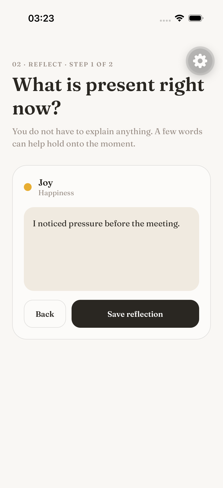
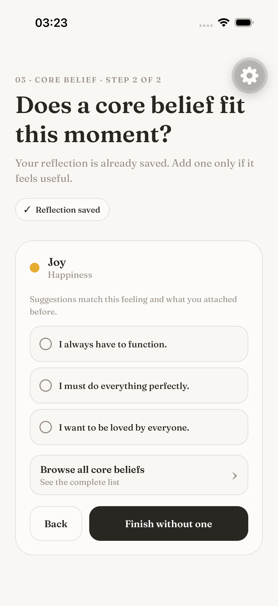
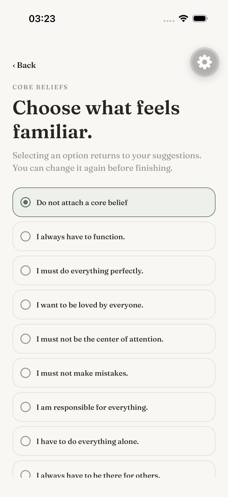
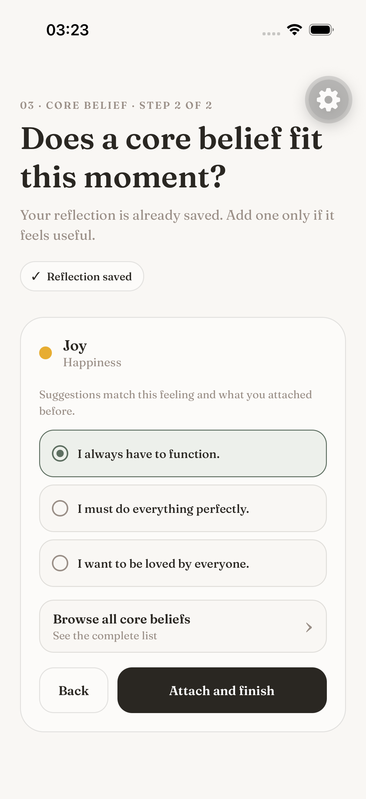
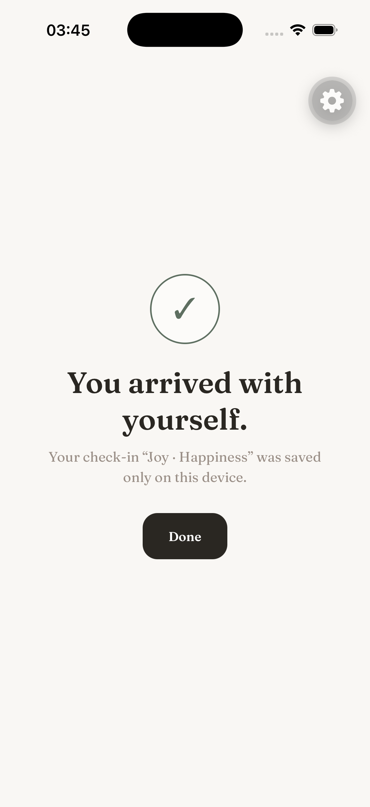
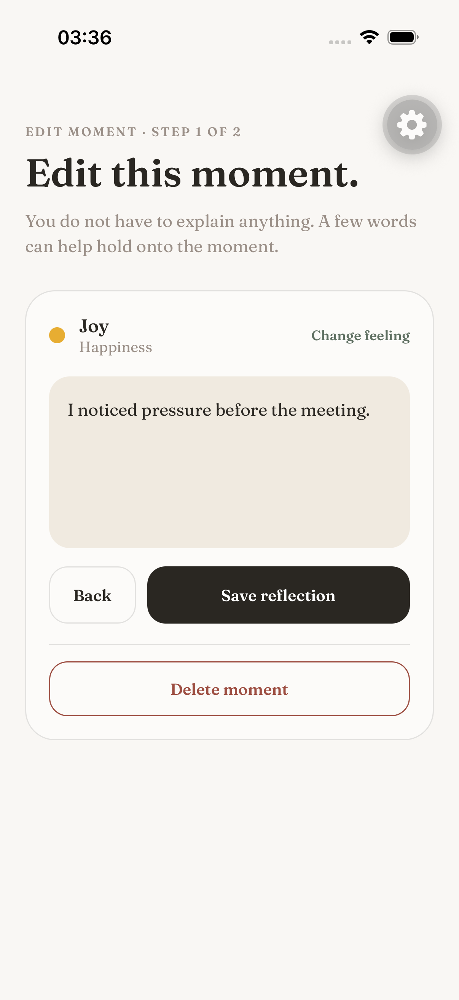

# Youmotion

Build, internal distribution, TestFlight, Google Play, and App Store release instructions are in [BUILD.md](./BUILD.md). Database setup, persisted schema, migration behavior, and native SurrealDB packaging are documented in [DB.md](./DB.md).

Youmotion is a private, local-first Expo app for noticing and recording emotions with a seven-direction feeling pulse. Dragging from the center chooses an emotion; distance chooses nuance and intensity. Releasing opens a short reflection that is saved before a separate, optional Leidsatz step. Individual history entries can be edited or permanently deleted after confirmation from the edit screen, the visible History action, or a long press on the History row.

This is a self-reflection tool, not a substitute for psychotherapy, medical advice, diagnosis, or emergency support.

## Stack

- Expo SDK 57, React Native 0.86, React 19.2, and Expo Router
- TypeScript 7.0 as the authoritative compiler
- XState 6 alpha for the complete app and navigation state graph
- XState Store for reactive check-in history
- Effect and Effect Schema for workflows, validation, errors, and JSON persistence
- fbtee 2 with English source strings and a German BCP 47 translation catalog
- Jest, React Native Testing Library 14, and React Native Harness
- Oxlint with TypeScript-7-powered type-aware linting and a project-local architecture plugin

`typescript-7` runs application type checks. Oxlint's type-aware engine uses `oxlint-tsgolint`, which is based on TypeScript 7. TypeScript 6 remains under the standard package name for Expo compatibility and the isolated custom-rule test parser.

## Architecture

The root XState machine is the single source of truth for tabs, nested check-in interaction, reflection, persistence, success, and failure. Expo Router routes are only a declarative projection of the current machine state. That makes every destination reachable by an event path and keeps the graph serializable for later persistence and model-based testing.

Persistence and hydration run as root-machine entry effects and report back through schema-typed machine events. This avoids an XState 6 alpha React Native defect where invoked `createAsyncLogic` children remain active after their promises resolve. Navigation model tests cover persistence success, storage failure, and retry so the workaround can be removed safely when the upstream alpha behavior is fixed.

```text
src/
  app/                       Expo Router route views
  navigation/                root navigation machine and router projection
  features/beliefs/           shared belief domain, persistence, and library UI
  features/check-in/
    domain/                  Effect Schemas and pure emotion geometry
    application/             XState Store
    infrastructure/          Effect-based local repository
    ui/                      self-contained screens and feeling pulse
  features/history/           history state, filtering, and screen
  features/settings/ui/
  infrastructure/database/    shared SurrealDB runtime and migrations
  localization/               app-wide locale primitives and providers
  preferences/                app-wide presentation preference primitives
  constants.ts               shared configuration and domain vocabulary
oxlint-rules/                tested local architecture plugin
```

The main graph contains these navigable states:

```text
tabs.today.idle → tabs.today.exploring → reflection → saving → beliefSystem → attaching → guidingBelief → persistingGuidingBelief → success
                                                ↘ failure → saving       ↘ catalog          ↘ failure → retry
                                                                          ↘ editor → persisting
tabs.today ↔ tabs.history ↔ tabs.settings → beliefLibrary ↔ beliefLibraryEditor
                                                ↘ saving / retiring → beliefLibrary
```

Persistence uses `Schema.parseJson` and typed `Schema.TaggedError` failures. There is no application dependency on Zod and no raw JSON parsing.

## Leidsätze and Leitsätze

In German, negative core beliefs are presented as `Leidsätze`. The app ships with 22 stable, locale-independent built-in IDs derived from the supplied source material. People can also add their own Leidsatz. A custom Leidsatz receives a stable local ID and joins the same catalog and recommendation system as the built-in entries.

Each Leidsatz can be associated with multiple emotions. The selected emotion provides an initial recommendation order, and repeated attachments to the same emotion promote that Leidsatz in later check-ins. New custom entries follow the built-in catalog until their use history promotes them. Learning and persistence remain entirely on-device.

The reflection, optional Leidsatz, and optional Leitsatz screens share a labeled, non-interactive progress trail so people can see which values remain available without creating a second navigation model. It is pinned above the scrollable, keyboard-aware page body, keeping the same screen position while content scrolls or the keyboard opens. The first action says that saving continues, and its supporting copy explains that later values can be added or changed. After the reflection has been persisted, the optional Leidsatz step shows three readable quick suggestions. A neutral, full-width catalog button opens all built-in and custom Leidsätze, and the catalog offers an action for adding a personal entry. No Leidsatz is attached unless the user explicitly selects one.

A selected Leidsatz continues to the dedicated `/guiding-belief` page. Its short reflection prompts are adapted from the supplied `Leitsätze-Verändern.pdf`: consider what the old rule once protected, where it restricts life now, and what a small change would look like tomorrow. The page then helps reformulate the Leidsatz into a compassionate positive `Leitsatz` while avoiding absolute language and keeping the result memorable.

The Leitsatz remains optional. A Leitsatz belongs to its Leidsatz rather than to a single check-in, so selecting the same Leidsatz during a fresh check-in reuses the previously saved Leitsatz. The reformulation page explains that origin whenever it prefills the editable value. An existing Leitsatz can be changed or removed; a custom Leidsatz's original wording can also be edited on this page. Editing a saved moment reopens emotion, intensity, nuance, note, attached Leidsatz, custom wording, and Leitsatz values without creating a second history entry. When the completed check-in has an attached Leidsatz with a Leitsatz, “Du bist bei dir angekommen” shows that positive statement. Persisted check-ins reference the stable ID; custom Leidsatz text and attached Leitsätze are stored separately in the local database. Built-in display copy remains localized at render time.

Settings links to the dedicated `/belief-library` page for managing custom Leidsätze. Editing keeps the stable ID and therefore updates the wording shown in earlier moments; the editor makes that shared-data behavior explicit. Removing an unused custom Leidsatz physically deletes its record. Removing one that is still referenced sets its optional `archivedAt` timestamp instead: archived records remain hydrated so history can resolve the original Leidsatz and Leitsatz, but they are excluded from new catalogs and recommendations. Built-in Leidsätze cannot be edited or removed through this library.

### Belief-system flow

<p>
  
  
  
</p>
<p>
  
  
</p>

### Deleting a moment

The edit screen provides a full-width destructive action. History keeps a visible action on every row, and long-pressing the row opens the same confirmation.

<p>
  
  
</p>

## Development

```bash
corepack enable
pnpm --version
pnpm install
pnpm start
```

The project pin is pnpm 11.18.0. Run `pnpm --version`; a compatible pnpm 11 installation may continue when registry signature verification prevents Corepack from installing the exact pin. The repository commits a pnpm lockfile; do not generate npm or Yarn lockfiles.
`pnpm start` targets the Youmotion development client and displays a QR code. Use `pnpm start:tunnel` when a physical device cannot reach the computer over the local network.

Install a development client once on each physical device before scanning Metro QR codes. Android internal builds produce an installable APK. iOS device builds require an Apple Developer account and a registered device:

```bash
pnpm dlx eas-cli@latest login
pnpm dlx eas-cli@latest init
pnpm dlx eas-cli@latest build --platform android --profile development
pnpm dlx eas-cli@latest build --platform ios --profile development
```

After installing the resulting build, open Youmotion and scan the QR code printed by `pnpm start`. Rebuild the client only when native dependencies or native configuration change; ordinary TypeScript, styling, and translation changes load through Metro.

Native fingerprints make that rebuild decision explicit. These local commands use Expo's pinned SDK 57 fingerprint implementation and require no Expo account; an unchanged platform hash means the installed development client is still compatible:

```bash
pnpm fingerprint:android
pnpm fingerprint:ios
```

For simulators and emulators, EAS CLI can find and install an existing development build with the same fingerprint, or create one when no match exists:

```bash
pnpm dlx eas-cli@latest build:dev --platform android
pnpm dlx eas-cli@latest build:dev --platform ios
```

EAS dependency caches remain enabled by default, and the development profile enables the EAS compiler cache. Local iOS builds compile React Native from source because the SDK 57 precompiled React framework does not contain a development symbol required by `expo-dev-launcher`; the native project is ccache-ready, and `brew install ccache` enables that cache on this Mac. Do not cache `node_modules` separately because pnpm and EAS already restore dependencies from the lockfile and package caches.

Build and launch the native development apps, or open web from Expo's terminal UI:

```bash
pnpm ios
pnpm android
pnpm web
pnpm lint
pnpm lint:rules
pnpm typecheck
pnpm typecheck:compat
pnpm test
pnpm test:coverage
pnpm test:e2e
pnpm test:e2e:smoke
pnpm verify
pnpm test:harness
pnpm doctor:react
```

### Install a Release build on a connected phone

These are full first-install commands: no previous Youmotion installation or Expo Update-enabled binary is required. They compile and install the app's native Release configuration directly over USB. The JavaScript bundle is embedded, so Metro does not need to be running after installation. The resulting local build targets the `development` EAS Update channel configured in `app.json`; it is intended for real-device release testing, not App Store or Google Play submission.

Install dependencies first, connect and unlock the phone, and then follow the platform-specific setup:

- iPhone: use macOS with Xcode, enable Developer Mode on the phone, trust the computer, and select a valid Apple development team when Xcode asks. A signed install is still required even though the phone is connected by cable.

  ```bash
  pnpm install:release:ios
  ```

- Android: enable Developer options and USB debugging, accept the computer's authorization prompt, and confirm that `adb devices` lists the phone with the status `device`.

  ```bash
  pnpm install:release:android
  ```

Each command prompts for a connected device when more than one is available. The Android build uses the repository's local release variant and debug signing key; the iOS build uses the selected Apple development team. Reinstall after native dependency, native configuration, or runtime-version changes. JavaScript and asset-only changes for the same runtime can instead be published with `pnpm eas:update:development`.

`pnpm typecheck` invokes TypeScript 7 directly. `typecheck:compat` checks the compatibility compiler used by editor and lint integrations.
The pnpm patches for `expo-modules-core` and `expo-modules-jsi` keep Expo SDK 57 buildable with the repository host's Xcode 26.1 Swift compiler. They only replace invalid immutable weak references with mutable weak references and can be removed after moving to Expo's supported Xcode 26.4 or newer toolchain.

The `expo-dev-launcher` patch backports Expo's Android `onUserLeaveHint` fix for the launcher delegate. Remove it after upgrading to an Expo SDK 57 package that includes [expo/expo#47347](https://github.com/expo/expo/pull/47347).

## Internationalization

fbtee compiles inline translator-aware source strings through Babel. English (`en-US`) is the source language, German (`de-DE`) is maintained in `translations/de-DE.json`, and the initial locale follows the device preference from `expo-localization`. The language can be changed from Settings.

```bash
pnpm i18n:collect
pnpm i18n:prepare
pnpm i18n:compile
pnpm i18n:all
```

`i18n:prepare` adds new phrases to the editable German catalog with a `new` status. Translate those entries and remove the status before committing. The compact runtime catalog under `src/translations` is generated during `pnpm install` and intentionally ignored.

Persisted check-ins store stable emotion IDs, intensity, nuance levels, and an optional `beliefSystemId` rather than localized labels. Existing German-label records and records without a belief system remain readable and are projected into the active locale at render time. User-authored Leidsätze and Leitsätze retain the language in which they were entered and are not passed through the translation catalog. The separate `belief_statement` record owns custom wording, an optional guiding statement, and an optional archive timestamp. Repository retirement checks the complete `check_in` table rather than the 30-entry presentation cache before deciding between archival and physical deletion, preventing dangling custom-belief references.

## Developer tooling

The repository includes Callstack's project-local React Native, navigation, upgrade, GitHub, and GitHub Actions agent skills. The tooling dependencies are pinned in the pnpm lockfile rather than installed globally.

The committed [Expo map guide](docs/expo-map.md) explains how to refresh the visual route map, replay its Argent flows, and upload the latest `.appmap` bundle to the AppMap Visualiser.

Pressto provides consistent press feedback for the app's tap controls. A shared configuration uses subtle scale compression, a near-critically damped spring, and the system reduced-motion preference; direct-manipulation gestures such as the feeling pulse keep their gesture-specific feedback.

Use a development build when working with native tooling. Expo Go cannot load Inspector, React Native Grab, Nitro Modules, or the Ottrelite Tracy backend.

```bash
pnpm start:tools
pnpm devtools:react
pnpm devtools:inspector
```

`start:tools` enables Rozenite with its Metro require profiler and performance monitor. React Native Grab is available from the development menu and is wrapped around every native route. `devtools:react` exposes the React tree and profiler to agent tooling. Inspector is opt-in for release profiling: start its server, then run a release development build with `WITH_INSPECTOR=true`.

Ottrelite installs the Tracy backend only in development JavaScript. Native development builds include the backend and Nitro Modules. `pnpm ios` prepares the pinned Tracy 0.12.2 sources before CocoaPods runs. Start Tracy 0.12.2 on the host; for Android, run `pnpm tracy:android` to forward port 8086 before recording. Tracy does not support Ottrelite async events, so use synchronous events and counters for Tracy sessions.

Reassure has a first domain performance scenario and keeps measurements under the ignored `.reassure` directory:

```bash
pnpm perf:baseline
pnpm perf:measure
pnpm perf:stability
```

React Doctor is available through `pnpm doctor:react`. Cali is available through `pnpm cali:review`; its device QA and performance review roles additionally require a built app artifact, provider credentials, and the relevant local device tooling.

The [AI skill evaluation](docs/ai-skills-evaluation.md) selected and pinned the
base `callstack/agent-device` skill for connected physical-device validation,
alongside Argent for simulator/emulator work. The matching CLI is installed
locally; use `pnpm exec agent-device doctor` to inspect the host setup before a
real-device session. Skillgym is available through `pnpm exec skillgym` for
rerunning retained skill evaluations. The separate
`callstackincubator/eas-agent-device` cloud workflow remains a later TODO after
an EAS preview-build and secrets strategy exists.

## Enforced code boundaries

The local Oxlint JavaScript plugin rejects framework imports in domain code, infrastructure imports from UI, implicit feature APIs, React state/effect hooks, multiple actor hooks, inline JSX callbacks, multi-parameter application functions, type assertions, switches, synchronous Schema parsing, barrels, comments, and Effect barrel imports. Oxlint also runs native React, TypeScript, Import, Promise, Jest, accessibility, cycle, depth, and complexity checks.

The rule suite lives beside the plugin and should be extended whenever a new invariant is introduced.

The external `eslint-plugin-code-architecture` gate complements those local
rules with blocking design-token, domain-literal, Effect, React, module,
function-bound, assertion-density, and compound-component checks. Its complete
applicability table and intentional test/runtime-fixture exclusions are documented in
[`docs/code-architecture-eslint.md`](docs/code-architecture-eslint.md).

## Testing strategy

- Pure tests cover vector-to-emotion selection and intensity thresholds.
- Repository tests execute Effect programs against mocked native storage, including typed decode, custom Leidsatz persistence, deletion, and storage failures.
- Navigation tests drive the actual root actor through persistence, Leidsatz attachment, custom entry creation, dedicated guiding-belief navigation, complete saved-moment editing, Leitsatz persistence and removal, deletion, and route event paths.
- Screen tests render the painterly star and exercise reflection, built-in and custom Leidsatz selection, the dedicated guiding-belief page, Leitsatz display, persistence, history deletion, success, and settings.
- Harness tests exercise custom Leidsatz persistence and emotion-label SVG nodes on the native React Native runtime.
- Argent flows exercise tab navigation, reflection cancellation, a persisted check-in save-and-delete journey, language switching, emotion-label settings, and redacted reminder lifecycles through the installed development app. The repository runner executes every selected flow twice unchanged.
- The pre-release Android locale gate builds and clean-installs the release APK, then verifies first-launch onboarding before and after an app-process restart. Run both cases on dedicated emulators configured through Android Settings:

  ```bash
  pnpm test:e2e:release:android:locale:de
  pnpm test:e2e:release:android:locale:en
  ```

  Start one disposable Android emulator and set `ANDROID_SERIAL` to its `emulator-*` identifier. In Android Settings > System > Languages, keep both supported languages and move the requested language first: German then English for the German command, or English then German for the English command. The runner validates that exact order before uninstalling the app, clean-installing the release APK, and running the matching Argent assertion twice. Set `E2E_RELEASE_SKIP_BUILD=true` to exercise an existing APK, or `E2E_RELEASE_APK` to select a release APK at another path.
- React Native Harness is configured for web, iOS, and Android device-level component testing.

The current Jest coverage gate is enforced globally and must not be lowered.

Use `pnpm test:harness:ios` and `pnpm test:harness:android` for the native simulator and emulator gates. Both start Harness on dedicated ports and launch the Expo development client directly into that server. Android defaults to the API 36 `Pixel_9` AVD and installs `android/app/build/outputs/apk/debug/app-debug.apk` when that artifact exists; run `pnpm android` once after a clean native checkout to create it. When other emulators are running, scope both layers explicitly: `ANDROID_SERIAL=emulator-5556 RN_HARNESS_ANDROID_AVD=Pixel_10_API_36_AOSP pnpm test:harness:android`. The wrapper rejects a missing or physical `ANDROID_SERIAL` for the emulator runner. With a Google Pixel 6a connected, `ANDROID_SERIAL='<serial>' pnpm test:harness:android:pixel` runs the same suite and validates the model before launch. `pnpm test:harness` uses the default web runner and must not be treated as evidence that Hermes, native SVG behavior, or native bindings work. Harness uses ports 8083 and 8084 and searches upward when one is occupied; stop stale Harness/Metro processes if its complete range is unavailable.

The emotion-label regression suite asserts the rendered React Native text node set for emoji-only, text-only, and combined modes at both the component and React Native Harness layers. It covers every active/inactive layout, verifies the combined-mode vertical separation, and rerenders the seven-label ring through every active emotion. A native image snapshot then verifies the pixels after those transitions, catching native rendering defects that are already absent from React's query tree.

Run the focused Android regression on an emulator with `pnpm test:harness:android -- emotion-label-modes.harness.tsx`, or replace the script with `pnpm test:harness:android:pixel` for a connected Pixel 6a. This structural and visual native test should be a release gate for changes to emotion labels, settings propagation, React Native, Reanimated, or native rendering dependencies; the ordinary Jest suite remains the fast gate for every change.

### Argent end-to-end tests

Install Argent with `npx @swmansion/argent@latest init -y`, boot a dedicated iOS simulator or Android emulator, and install the Youmotion development client once with `pnpm ios` or `pnpm android`. Confirm the target and copy its UDID or emulator serial:

```bash
pnpm --version
argent --version
argent run list-devices --json
```

Keep the dedicated E2E Metro server running in terminal A. It uses port 8091 and `EXPO_PUBLIC_E2E=true`, which removes the development-only React Native Grab wrapper from the accessibility tree:

```bash
pnpm start:e2e
```

In terminal B, scope every run to a device that no other task is using. The full runner recycles only that target's Argent services and runs each development flow twice unchanged:

```bash
export E2E_DEVICE='<iOS UDID, Android emulator serial, or connected test-device serial>'
export E2E_PLATFORM='ios'
pnpm test:e2e
```

Use `E2E_PLATFORM=android` for an emulator or connected Android test device. The runner restores ADB reverse and force-stops the development app before every pass. Run `pnpm test:e2e:smoke` for the short navigation gate. To isolate one journey while keeping the same two-pass contract:

```bash
pnpm test:e2e --flow reminder-owned-timing.yaml
pnpm test:e2e --flow emotion-check-in-reminder.yaml
```

The app id is `com.youmotion.mobile`. Normal Metro uses 8081, E2E uses 8091, and Harness starts at 8083/8084. The runner exits before device interaction when the explicit target or Metro server is missing. Failure snapshots are written to ignored `artifacts/argent/`; flows are under `.argent/flows/e2e/` and use fixed synthetic text that they remove before finishing.

Reminder changes should additionally run the focused Jest suites and follow [the reminder runtime matrix](docs/reminders-runtime-test-matrix.md). `reminder-owned-timing.yaml` covers assignment-owned timing, General message/Show Leitsatz choice, management actions, and cleanup. `emotion-check-in-reminder.yaml` covers creation, outside-tap time-modal dismissal without changing `09:00`, activation, test notification, Settings verification, and deletion. Neither flow reads or writes personal journal data.

The guiding-belief overview displays each reminder's saved days and times even when it is off. Existing reminders can also be turned off from their editor; this keeps the saved schedule and discards unsaved edits. The native `gentle-reminder.harness.tsx` regression flow restores the committed synthetic archive into a dedicated test database, checks persistence and notification cancellation, and captures English/German screenshots. Run it with `pnpm test:harness:ios --runTestsByPath src/features/reminders/__tests__/gentle-reminder.harness.tsx` or `ANDROID_SERIAL=<dedicated-emulator-serial> pnpm test:harness:android --runTestsByPath src/features/reminders/__tests__/gentle-reminder.harness.tsx`. Prepare a local Harness UI iOS build first with `pnpm prepare:harness:ios`; Android requires the development APK installed on the dedicated Pixel_9 emulator. See [the handoff](docs/handoffs/gentle-reminder-timing-and-deactivation.md) for build prerequisites and evidence.

## Local Codex skills

Project-local skills are installed under `.agents/skills`, including Software Mansion's React Native debugging workflows, Emil Kowalski's design and animation reviews, Builder.io's visual planning workflow, and Callstack's React Native Harness guidance.
Their upstream sources, pinned revisions, copyright notices, and license terms are recorded in [THIRD_PARTY_NOTICES.md](THIRD_PARTY_NOTICES.md).

## Source material

The interaction language and emotion vocabulary were derived from the supplied Youmotion and therapeutic reference material. The built-in Leidsatz catalog was transcribed from the supplied `Leitsätze.pdf` and `Mögliche-Leitsätze.pdf`; near-identical statements were normalized into stable source-controlled entries. The dedicated reformulation prompts were adapted from the supplied `Leitsätze-Verändern.pdf`. The implementation also follows the linked vertical-codebase, self-contained-component, TigerStyle, XState 6 alpha, and custom-linting references.
