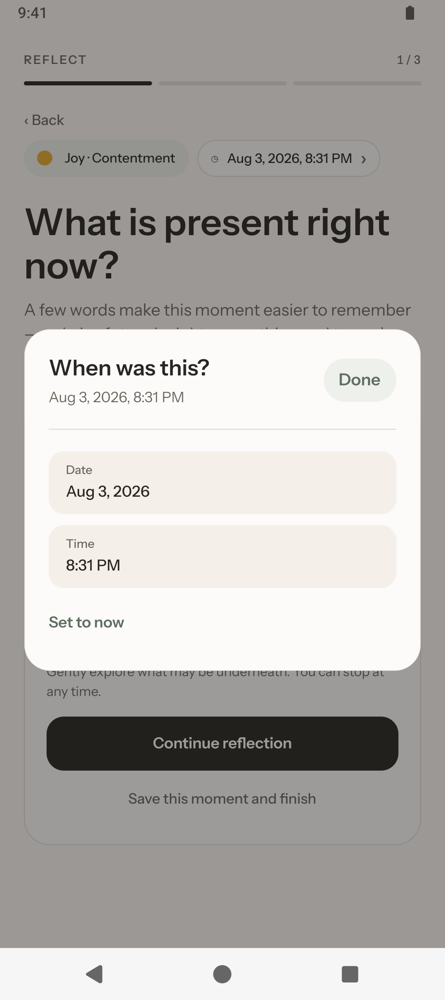
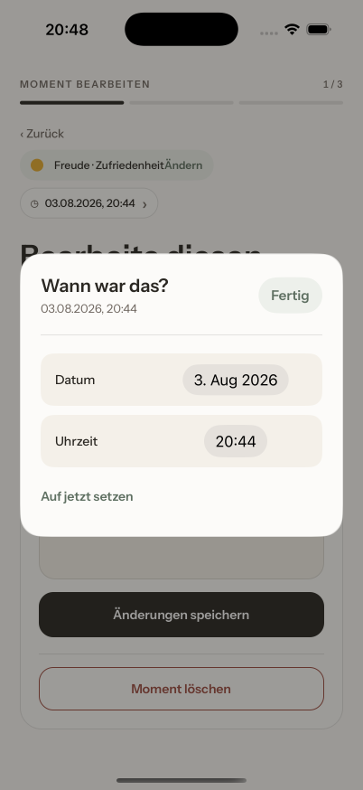

# Migration 0001: backfill check-in occurrence time

## Why it exists

Editable moment times added `occurredAt` to every check-in. Older app versions stored only `createdAt`. The native SurrealDB client returns a missing selected field as `NONE`; decoding that value as the current `CheckIn` schema made History hydration fail and could make intact entries appear unavailable.

The supplied 2026-08-03 backup confirmed the legacy shape: all 133 check-ins had a valid `createdAt` and no `occurredAt`. The rollback restored access because it removed the new required read. Migration `0001-backfill-check-in-occurrence-time` permanently upgrades those database rows by copying `createdAt` into `occurredAt`.

## Files

| File | Responsibility |
| --- | --- |
| `src/features/check-in/infrastructure/migrations/database-migration.ts` | Branded migration ID and migration contract |
| `src/features/check-in/infrastructure/migrations/database-migrations.ts` | Ordered, append-only registry |
| `src/features/check-in/infrastructure/migrations/database-migration.runner.ts` | Ledger decoding, pending selection, transactions, and typed failures |
| `src/features/check-in/infrastructure/migrations/occurrence-time.database-migration.ts` | Migration 0001 statement and description |
| `src/features/check-in/infrastructure/surrealdb.database.ts` | Runs pending migrations before releasing the shared connection |
| `src/features/check-in/infrastructure/check-in.repository.ts` | Strict post-migration decoder; contains no occurrence-time fallback |
| `src/features/check-in/__tests__/database-migration.runner.test.ts` | Runner, ledger, malformed-data, and retry tests |
| `src/features/check-in/__tests__/database-migration.runner.harness.ts` | Native SurrealKV backfill and idempotency test with 133 redacted rows |
| `src/features/check-in/__tests__/surrealdb.database.test.ts` | Startup ordering, shared callers, and connection retry tests |
| `src/features/check-in/__tests__/check-in.repository.test.ts` | Consumer boundary rejects legacy rows if startup migration did not run |
| `src/features/data-safety/__tests__/supplied-legacy-archive.e2e.test.js` | Optional local test of the supplied private archive without committing it |

The ledger table name, `database_migration`, is owned by `src/constants.ts`.

## Startup flow

```text
first repository caller
  -> getDatabase() creates and connects the embedded SurrealKV client
  -> runner defines the schemaless database_migration table if absent
  -> runner reads and Effect-Schema-decodes database_migration
  -> runner compares the ledger with the ordered registry
  -> each pending migration runs sequentially in its own transaction
       data statement
       + ledger UPSERT
       + COMMIT
  -> the fully migrated shared connection is returned
  -> repositories query and strictly decode current schemas
```

The ledger bootstrap is required because the embedded native engine rejects a `SELECT` from a table that has never existed. `DEFINE TABLE IF NOT EXISTS database_migration SCHEMALESS` makes fresh installs deterministic without changing an existing ledger. The connection promise is cached, so concurrent startup callers share the same connection-and-migration attempt. No repository can hydrate from that promise before migrations finish.

For migration 0001, the transactional data statement is:

```sql
UPDATE check_in
SET occurredAt = createdAt
WHERE occurredAt = NONE;
```

Rows with an explicit `occurredAt` are unchanged. The ledger entry and the data update commit together. If the query fails, neither is considered successfully applied; connection initialization rejects, the cached promise is cleared, and the next caller retries from the ledger. Malformed ledger data fails closed with `DatabaseMigrationDataError` rather than guessing which migrations ran.

## Archive restore is a separate boundary

Database migrations upgrade rows already stored in SurrealKV. Backup archives are external persisted input and are versioned independently by `DataArchiveFromJson` in the data-safety feature.

A version 1 archive is decoded and upgraded in memory before it can be restored. Its missing `occurredAt` values become `createdAt`, and the restored rows are written in the current shape. The database ledger is deliberately not exported or restored: it describes the receiving installation's database, not the user's journal content.

## Verification matrix

| Boundary | Case | Expected result |
| --- | --- | --- |
| Database startup | Fresh database | Ledger table is bootstrapped, then 0001 and its ledger record commit |
| Database startup | Legacy-only or mixed rows | Missing values are backfilled; explicit values are preserved |
| Database startup | Ledger already contains 0001 | No data statement runs |
| Database startup | Transaction fails | Startup fails, no successful ledger entry is observed, later startup retries |
| Database startup | Concurrent callers | All await one cached migration attempt |
| Repository | Legacy `NONE` reaches strict decoder | `CheckInDataError` proves migration bypasses are visible |
| Archive boundary | Version 1 archive | Decoder upgrades every missing occurrence time before restore |
| Supplied archive | 133-entry redacted backup | All 133 entries upgrade and survive a version 2 encode/decode round trip |

Standard verification:

```bash
pnpm verify
pnpm test:coverage
pnpm test:harness:ios
pnpm test:harness:android
```

A synthetic archive fixture is committed at `src/features/data-safety/__tests__/fixtures/legacy-archive.fixture.json`. It carries the same shape as a real export — 133 moments and 15 guiding beliefs, 12 suggested and 3 authored — with neutral text, so it is safe to commit and safe to screenshot. Its test runs by default:

```bash
CI=true pnpm exec jest \
  src/features/data-safety/__tests__/supplied-legacy-archive.e2e.test.js \
  --runInBand --no-watchman
```

Use the committed fixture for device runs, restores, and map captures. A private export can still be checked against the same test without ever entering Git:

```bash
YOUMOTION_LEGACY_ARCHIVE_PATH=/absolute/path/to/youmotion-backup.json \
  CI=true pnpm exec jest \
  src/features/data-safety/__tests__/supplied-legacy-archive.e2e.test.js \
  --runInBand --no-watchman
```

The test checks structure, counts, timestamps, and round-trip compatibility; it does not print or copy note content.

## Adding migration 0002 and later

1. Create one directly imported file in `src/features/check-in/infrastructure/migrations/`, for example `normalize-example.database-migration.ts`.
2. Export a `DatabaseMigration` with a new zero-padded, immutable ID such as `0002-normalize-example`, a concise description, and an idempotent SurrealQL statement.
3. Append it to `DATABASE_MIGRATIONS` in `database-migrations.ts`. Never reorder, rename, reuse, or edit the meaning of an ID that may have shipped.
4. Let the runner own `BEGIN`, the ledger UPSERT, and `COMMIT`; the migration statement must not manage its own transaction or ledger row.
5. Update the current repository decoder to accept only the post-migration shape. Do not hide an incomplete migration with permanent read-time coercion.
6. Add runner tests for pending and already-applied behavior, a consumer-boundary test, and native Harness coverage when SurrealDB types or serialization are involved.
7. Cover fresh, legacy/mixed, failure/retry, and idempotent paths. Add navigation model coverage if user-visible states or events change.
8. Add a document in `docs/migrations/` describing evidence, affected files, behavior, verification, privacy constraints, and lifecycle.
9. Run the standard verification commands above.

Prefer statements that can safely run more than once even though the ledger normally prevents that. This protects development fixtures, manual recovery, and future compaction work.

## Lifecycle and removal

The temporary read-time occurrence fallback has been removed. The durable 0001 migration must remain in the registry after release: a local-first user can skip many versions, keep an old installation offline, or return years later with an untouched database. This differs from a feature flag because eligibility is stored per local database, not controlled by a rollout window.

An old migration may be compacted only when all supported installation paths establish the same post-migration invariant without executing it. That requires all of the following:

- a versioned database bootstrap or snapshot explicitly marks the old migration as satisfied;
- direct upgrades from every still-supported historical database are either impossible or covered by another tested upgrader;
- old archives are still upgraded at their own decode boundary;
- native upgrade tests prove dormant installations cannot bypass the invariant;
- the compaction decision and minimum supported database baseline are documented.

Until then, keep the small migration definition and ledger history. Applied migrations are dormant and add only one ledger read at startup; their data statements do not rerun.

## User interface

The migration has no UI. The related feature uses the native date/time modal during creation and History editing:





